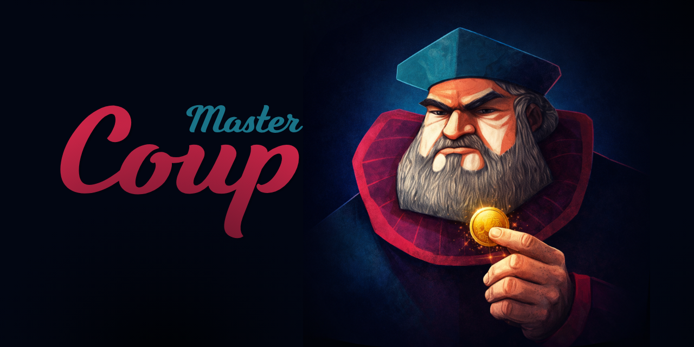

# Coup Master 3D - Em Desenvolvimento


<p align="center">
  
</p>

## 📖 Sobre o Projeto

**Coup Master 3D** é uma mesa virtual sandbox para jogar Coup Master diretamente no navegador. O projeto usa **HTML**, **CSS**, **JavaScript**, **Three.js/WebGL**, **Rapier 3D** e **Firebase** para criar uma experiência 3D inspirada na liberdade do **Tabletop Simulator**.

A proposta não é automatizar todas as regras do Coup. O foco do modo casual é oferecer uma mesa digital confortável, física e manipulável, onde os próprios jogadores conduzem blefes, desafios, acordos, trocas, eliminações e combinados de mesa.

O projeto nasceu a partir da evolução experimental do Coup Master 2D, mas agora segue como um repositório separado, focado na experiência 3D.

🔗 **Jogue agora:** [https://gabrielbarbosa0.github.io/Coup-Master-3D](https://gabrielbarbosa0.github.io/Coup-Master-3D)

---

## 🖼️ Preview

  

---

## 🚧 Status Atual do MVP

O Coup Master 3D está em **MVP 0.1 online casual**, em desenvolvimento ativo.

| Área | Estado atual |
| --- | --- |
| Modo principal | `index.html` |
| Login | Google ou visitante anônimo |
| Lobby | Criar sala ou entrar por código curto |
| Mesa | 3D octogonal com até 8 jogadores |
| Física | Rapier 3D |
| Renderização | Three.js/WebGL |
| Online | Firebase Authentication + Realtime Database |
| Sincronização | Parcial, por snapshots finais e ações discretas |
| Hospedagem | GitHub Pages |
| Instalação | PWA em modo `standalone` |

### Importante

Movimentos de drag livre ainda **não são sincronizados frame a frame**. Nesta etapa, a mesa sincroniza o estado final de ações manuais e algumas animações discretas, como comprar carta, distribuir cartas e devolver carta ao deck.

Isso mantém o MVP mais leve, reduz escritas no Firebase e evita travamentos visuais enquanto a base multiplayer casual amadurece.

---

## 🚀 Funcionalidades Principais

### 🎲 Mesa 3D Sandbox

- Mesa octogonal em Three.js.
- Até 8 slots de jogador.
- Câmera orbitável com zoom, pan e foco no jogador.
- Manipulação manual de cartas, deck, pilhas, moedas e extras.
- Resgate automático de objetos que caem fora da mesa.
- Experiência inspirada em mesa física e Tabletop Simulator.

### 🔐 Login, Lobby e Salas

- Login com Google Authentication via Firebase.
- Login como visitante anônimo.
- Lobby em `lobby.html`.
- Instalação opcional como PWA com o nome **Coup Master**.
- Execução em janela própria no modo `standalone`, sem a barra comum do navegador.
- Criação de salas com código curto de 4 caracteres.
- Entrada direta em sala existente.
- Jogadores salvos em `rooms/{roomCode}/players/{uid}`.
- Assentos reservados por conta.
- Lista de jogadores visível no HUD da mesa.
- Contador manual de moedas por jogador direto na lista da sala.
- Host pode remover jogadores da sala e liberar assentos explicitamente.
- Fechar ou minimizar a aba não libera automaticamente o slot.
- Criador da sala é o administrador permanente da sala casual.

### 🃏 Cartas, Deck e Pilhas

- Cartas 3D finas com frente, verso e lateral.
- Cantos arredondados reais.
- Deck físico central com limite visual de cartas empilhadas.
- Clique no deck para comprar carta para o jogador ativo.
- Clique e arraste para puxar carta.
- Duplo clique em carta fechada devolve ao deck.
- Cartas abertas não voltam ao deck automaticamente.
- Pilhas compatíveis podem se agrupar.
- Pilhas podem ser movidas, viradas e giradas.

### 🪙 Objetos e Cartas Especiais

- Moeda de ouro.
- Moeda de prata.
- Duplo clique em moedas remove o objeto.
- Carta especial de Asilo.
- Carta especial de Religião.
- Extras podem ser arrastados, virados, girados e deletados.
- Moedas e extras nascem próximos ao slot do jogador que solicitou.
- Contador manual no HUD para anotar moedas por jogador sem depender apenas das moedas físicas.

### 💬 Chat e Comunicação

- Chat em tempo real por sala.
- Mensagens livres.
- Mensagens rápidas de blefe/ação, como declarar personagem, contestar ou bloquear.
- Atalho `C` para abrir o chat.
- Ícone lateral de chat.
- Base preparada para histórico/logs de mesa no futuro.

### 👻 Modo Espectador

- Jogador pode pedir permissão para espectar a mão de outro jogador.
- O alvo recebe modal para aceitar ou recusar.
- Quando aceito, o espectador passa a ver a mão daquele slot.
- Útil para partidas casuais com jogadores eliminados assistindo blefes.

### 🔊 Áudio e HUD

- Música de fundo em `assets/sounds/soundtrack/bgm.mp3`.
- Botão para mutar/desmutar música.
- Volume de música e efeitos no modal de configurações.
- Efeitos sonoros para cartas, moedas e reset.
- HUD por ícones com barras compactas.
- Tela de carregamento evita exibir HUD/mesa antes do login, sala e estado inicial estarem prontos.
- Modal de regras alternativas com 5 páginas de referência.
- Código da sala clicável no HUD.
- Lista de jogadores com controles `- valor +` para ajustar manualmente moedas.
- Botão de reset visível apenas para administrador.

---

## 🎮 Controles

### Mouse e Touch

| Ação | Controle |
| --- | --- |
| Rotacionar câmera | Botão esquerdo em área vazia / um dedo no touchscreen |
| Pan da câmera | Botão do meio / clique no scroll / dois dedos no touchscreen |
| Zoom | Scroll do mouse |
| Comprar carta | Clique no deck |
| Puxar carta do deck | Clique e arraste rapidamente no deck |
| Mover deck | Clique, segure e arraste o deck |
| Arrastar carta, pilha, moeda ou extra | Clique, segure e arraste |
| Devolver carta ao deck | Duplo clique na carta |
| Remover moeda | Duplo clique em moeda de ouro ou prata |
| Ajustar contador de moedas | Botões `-` e `+` ao lado do nome do jogador |
| Selecionar objeto para atalho | Hover do mouse |

### Teclado

| Tecla | Ação |
| --- | --- |
| `F` | Vira carta, pilha ou extra sob hover/seleção |
| `C` | Abre o chat da sala |
| `Q` | Gira objeto selecionado para a esquerda |
| `E` | Gira objeto selecionado para a direita |
| `R` | Embaralha deck ou pilha sob hover |
| `Alt` | Inspeciona de perto o objeto sob o mouse |
| `Delete` / `Backspace` | Remove objeto selecionado |
| `Space` | Foca a câmera no jogador ativo |
| `Escape` | Fecha modais abertos |

---

## 🛠️ Tecnologias

| Área | Tecnologia |
| --- | --- |
| Frontend | HTML5, CSS3, JavaScript |
| Módulos | ES Modules |
| Renderização 3D | Three.js / WebGL |
| Física | Rapier 3D |
| Câmera | OrbitControls |
| Autenticação | Firebase Authentication |
| Banco em tempo real | Firebase Realtime Database |
| Hospedagem | GitHub Pages |
| Assets | PNG, SVG, fontes, áudio e canvas procedural |

---

## 🎲 Como Jogar

1. Acesse o jogo pelo GitHub Pages ou rode localmente.
2. Entre com Google ou como visitante.
3. No lobby, crie uma sala ou informe um código existente.
4. Compartilhe o código com os outros jogadores.
5. Ao entrar na mesa, use a câmera para navegar pelo tabuleiro.
6. Clique no deck para comprar cartas.
7. Arraste cartas, pilhas, moedas e extras pela mesa.
8. Use atalhos ou botões do HUD para virar, girar, deletar e focar a câmera.
9. Use o chat para combinar ações, blefes e respostas.
10. Conduza as regras manualmente com o grupo.

> O modo casual é sandbox: os jogadores são responsáveis por declarar ações, contestar, bloquear e manter a partida honesta.

---

## 🏗️ Arquitetura

O Coup Master 3D separa a camada de mesa 3D da camada online:

```txt
Navegador do jogador
        |
        v
index.html + HUD DOM
        |
        v
js/three/boot.js
        |
        +--> valida login e sala
        +--> mantém a tela de carregamento durante o boot
        +--> conecta serviços Firebase
        +--> importa js/three/app.js
        |
        v
js/three/app.js
        |
        +--> renderização Three.js
        +--> física Rapier
        +--> interação com cartas, deck, moedas e HUD
        |
        v
Firebase Realtime Database
        |
        +--> players
        +--> tableState
        +--> tableActions
        +--> chatMessages
        +--> spectatorRequests
```

### Princípios atuais

- Manter `js/three/app.js` focado na mesa 3D.
- Manter Firebase isolado em `js/firebase/`.
- Sincronizar ações discretas quando houver gatilho claro.
- Evitar sincronização frame a frame do drag neste MVP.
- Evoluir a modularização depois que a experiência da mesa estiver mais estável.

---

## 📁 Estrutura de Pastas do Projeto

O projeto adota uma arquitetura modular baseada em responsabilidades bem definidas, separando os recursos estáticos (assets), as folhas de estilo (CSS) e o núcleo lógico do jogo (JS).

Estrutura real verificada no repositório:

```txt
Coup-Master-3D/
|-- index.html
|-- login.html
|-- lobby.html
|-- manifest.webmanifest
|-- service-worker.js
|-- README.md
|-- AGENTS.md
|-- LICENSE
|-- robots.txt
|-- sitemap.xml
|-- limpeza.json
|-- google9b3b720af3a4d43a.html
|
|-- css/
|   |-- online.css
|   `-- three-board.css
|
|-- js/
|   |-- pwa.js
|   |-- firebase/
|   |   |-- auth-service.js
|   |   |-- firebase-config.js
|   |   |-- firebase-rules.json
|   |   |-- login-page.js
|   |   |-- lobby-page.js
|   |   `-- room-service.js
|   |
|   `-- three/
|       |-- app.js
|       |-- boot.js
|       |-- config.js
|       `-- dom.js
|
|-- assets/
|   |-- fonts/
|   |-- img/
|   |   |-- cards/
|   |   |   |-- base/
|   |   |   |-- dlc1/
|   |   |   |-- dlc2/
|   |   |   |-- promo/
|   |   |   `-- religion/
|   |   |-- coins/
|   |   |-- guides/
|   |   |-- icons/
|   |   `-- logo/
|   |-- sounds/
|   |   |-- soundtrack/
|   |   `-- vfx/
|   `-- video/
|
|-- docs/
|   |-- GDD.md
|   `-- TDD.md
|
`-- marketing/
    `-- banners/
        |-- banner-coup-master.png
        `-- coup-master-capa.png
```

---

## ⚙️ Instalação, Configuração e Execução Local

Este projeto roda como site estático.

### 1. Clone o repositório

```powershell
git clone https://github.com/GabrielBarbosa0/Coup-Master-3D.git
cd Coup-Master-3D
```

### 2. Inicie um servidor local

Com Python:

```powershell
python -m http.server 4173
```

### 3. Abra no navegador

Fluxo online completo:

```txt
http://127.0.0.1:4173/login.html
```

Mesa direta, exigindo login e sala válida:

```txt
http://127.0.0.1:4173/index.html
```

Exemplo com sala:

```txt
http://127.0.0.1:4173/index.html?room=ABCD
```

### Testar a instalação PWA

1. Abra `http://127.0.0.1:4173/login.html` no Chrome ou Edge.
2. Aguarde o botão **Instalar Coup Master** aparecer.
3. Confirme a instalação no prompt nativo do navegador.
4. Abra o jogo pelo ícone criado no sistema.

No iPhone/iPad, use **Compartilhar > Adicionar à Tela de Início**. A PWA abre em modo `standalone`, mas autenticação, lobby e partidas online continuam exigindo conexão com a internet.

---

## 🔥 Configuração do Firebase

O Firebase é usado para:

- autenticação;
- login Google;
- login anônimo/visitante;
- criação e entrada em salas;
- reserva de assentos;
- snapshots da mesa;
- ações discretas;
- chat em tempo real;
- pedidos de espectador.

### 1. Crie o projeto no Firebase

1. Acesse o [Firebase Console](https://console.firebase.google.com/).
2. Clique em **Criar projeto**.
3. Adicione um app Web.
4. Copie as credenciais do objeto `firebaseConfig`.

### 2. Configure o app Web

As credenciais ficam em:

```txt
js/firebase/firebase-config.js
```

Exemplo de formato:

```js
const firebaseConfig = {
  apiKey: "SUA_API_KEY",
  authDomain: "seu-projeto.firebaseapp.com",
  databaseURL: "https://seu-projeto-default-rtdb.firebaseio.com",
  projectId: "seu-projeto",
  storageBucket: "seu-projeto.appspot.com",
  messagingSenderId: "...",
  appId: "..."
};
```

> A chave `apiKey` de um app Web Firebase não deve ser tratada como senha secreta. A segurança real depende de autenticação, regras do banco, domínios autorizados e validações futuras.

### 3. Ative os métodos de autenticação

No Firebase Console:

1. Vá em **Build > Authentication**.
2. Abra **Sign-in method**.
3. Ative **Google**.
4. Ative **Anonymous** se quiser permitir login visitante.
5. Em **Authorized domains**, adicione os domínios usados.

Para desenvolvimento local:

```txt
localhost
127.0.0.1
```

Para GitHub Pages:

```txt
gabrielbarbosa0.github.io
```

### 4. Configure o Realtime Database

O repositório possui um arquivo de referência:

```txt
js/firebase/firebase-rules.json
```

Regras atuais do MVP:

```json
{
  "rules": {
    "rooms": {
      "$roomId": {
        ".read": "auth != null",
        ".write": "auth != null"
      }
    },
    "users": {
      "$uid": {
        ".read": "auth != null",
        ".write": "auth != null && auth.uid === $uid"
      }
    }
  }
}
```

Essas regras são simples para o MVP casual. Para ranking, loja, DLCs pagas, inventário, temporadas e validações autoritativas, será necessário endurecer as regras e provavelmente usar Cloud Functions.

---

## 🌐 Publicação no GitHub Pages

Para publicar o projeto:

1. Acesse o repositório no GitHub.
2. Vá em **Settings > Pages**.
3. Em **Build and deployment**, selecione:

```txt
Source: Deploy from a branch
Branch: main
Folder: /root
```

4. Salve e aguarde o GitHub gerar a URL pública.

URL esperada:

```txt
https://gabrielbarbosa0.github.io/Coup-Master-3D/
```

O manifesto e o service worker ficam na raiz do repositório para manter o escopo da PWA em login, lobby e mesa. Ao alterar arquivos precacheados, incremente `CACHE_VERSION` em `service-worker.js` para invalidar o cache anterior das instalações existentes.

---

## 🛠️ Manutenção do Banco de Dados

Este projeto usa Firebase Realtime Database. Durante testes, salas antigas, mensagens e snapshots podem acumular dados.

### 🧹 Procedimento de Limpeza Manual

Caso o banco fique pesado:

1. Acesse o Firebase Console.
2. Vá em **Realtime Database**.
3. Selecione o nó desejado, por exemplo `rooms`.
4. Remova salas antigas manualmente.

O repositório também possui:

```txt
limpeza.json
```

Conteúdo atual:

```json
{}
```

> [!CAUTION]
> Importar `{}` sobre um nó do Realtime Database apaga os dados daquele nó. Use apenas em ambiente de desenvolvimento ou quando tiver certeza de que deseja limpar salas antigas.

### Limpeza automática

Ainda não há rotina robusta de limpeza automática por servidor. No futuro, Cloud Functions podem ser usadas para expirar salas antigas, limpar mensagens e aplicar regras mais fortes de manutenção.

---

## 🧠 Desafios Técnicos

- Criar uma mesa 3D manipulável e legível no navegador.
- Integrar Three.js com física Rapier sem instabilidade excessiva.
- Manter cartas, pilhas, deck e objetos sincronizados com estado local.
- Evitar tremor físico ao arrastar objetos.
- Sincronizar multiplayer casual sem transmitir drag frame a frame.
- Controlar assentos reservados sem liberar slot quando a aba fecha.
- Separar contadores manuais de moedas dos objetos físicos de moeda.
- Separar renderização 3D da lógica Firebase.
- Proteger cartas privadas enquanto ainda permite interação física.
- Dar suporte crescente a touchscreen.
- Manter HUD compacto em desktop e mobile.

---

## 📚 Aprendizados

Durante o desenvolvimento do Coup Master 3D, o projeto explora:

- renderização 3D com Three.js;
- física no navegador com Rapier 3D;
- modelagem de mesa sandbox;
- manipulação de objetos em WebGL;
- arquitetura modular em JavaScript;
- autenticação com Firebase;
- Realtime Database;
- sincronização parcial de estado;
- design de HUD para jogo 3D;
- responsividade para mobile/touch;
- planejamento com GDD e TDD.

---

## 📄 Documentação

Documentos auxiliares do repositório:

| Arquivo | Função |
| --- | --- |
| `docs/GDD.md` | Game Design Document: visão de produto, experiência, controles, HUD, roadmap e escopo |
| `docs/TDD.md` | Technical Design Document: arquitetura, estado local, sistemas, física, assets e critérios de aceite |
| `AGENTS.md` | Instruções para agentes de IA, Codex e colaboradores |
| `js/firebase/firebase-rules.json` | Regras atuais de referência para o Realtime Database |

---

## 🚀 Próximas Atualizações (Roadmap)

### MVP 0.1

- [x] Separar o repositório do Coup Master 3D.
- [x] Criar fluxo de login.
- [x] Criar lobby simples.
- [x] Criar salas com código curto.
- [x] Criar mesa 3D octogonal.
- [x] Adicionar deck central.
- [x] Adicionar cartas, moedas e extras manipuláveis.
- [x] Adicionar chat em tempo real.
- [x] Adicionar modo espectador inicial.
- [x] Adicionar contador manual de moedas por jogador.
- [ ] Refinar experiência mobile/touch.
- [ ] Melhorar estabilidade física em casos extremos.
- [ ] Adicionar preview oficial no README.

### MVP 0.2

- [ ] Modularizar `js/three/app.js`.
- [ ] Criar logs de mesa.
- [ ] Melhorar histórico de ações.
- [ ] Expandir ações discretas sincronizadas.
- [ ] Melhorar UX de inspeção de cartas.
- [ ] Criar tutorial inicial de controles.
- [ ] Melhorar ferramentas de host.

### Futuro

- [ ] Ranking.
- [ ] Matchmaking.
- [ ] Conquistas.
- [ ] Loja.
- [ ] Inventário.
- [ ] DLCs pagas ou desbloqueáveis.
- [ ] Cloud Functions para validações críticas.
- [ ] Backend autoritativo para modos competitivos.
- [ ] Temporadas.
- [ ] Replays ou logs avançados.

---

## ⚠️ Observação Legal

Este é um projeto independente e em desenvolvimento, criado como estudo de mesa digital sandbox, multiplayer casual, Three.js, Firebase e design de interação.

O projeto não tem como objetivo substituir uma implementação oficial de qualquer jogo comercial. A proposta é experimentar uma mesa virtual manual para grupos que já combinam suas próprias regras e variações.

---

## 📄 Licença

Este projeto é de código aberto sob a licença [MIT](LICENSE).
